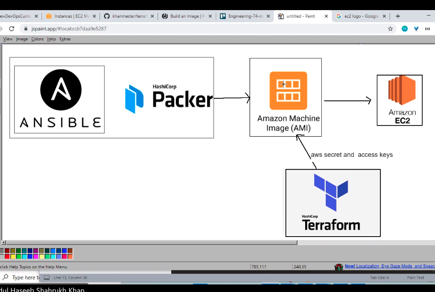

# Terraform
- Terraform Is a HashiCorp product (the same company that makes Packer and Vagrant)
- It's an IAC orchestration tool - it allows you to create IAC for
deployment on any cloud, which means it's cloud independent
- Cloud independent: Gives flexibility to be able to use different software or
cloud provider (e.g. Azure, AWS etc) by changing one or two lines, while keeping
 the rest of the code the same
- This is especially important as the industry is moving towards multi cloud
infrastructure (using multiple cloud providers to have the same infrastructure
  on multiple providers to decrease the chance and cost of downtime)
    - This functions similarly to a disaster recovery plan
    - If one provider goes down, the traffic can be diverted to the other provider
- Increases efficiency by automating the setup on AWS
- Uses ingress and egress rules as inbound and outbound rules
- Lets you scale up and down as needed

## Difference between Ansible and Terraform
- Ansible: Better at Configuration management (provisioning)
- Terraform: Better at Orchestration management (networking)
## Installation
- [Download](https://www.terraform.io/downloads.html) the correct Zip file for your OS
- Extract the application file and either move it to a location in your OS's PATH
or add the desired location to the OS PATH
- For Windows you can simply move the file to the Windows or Program Files folder
## Syntax
### General Syntax
- Language used is HCL similar to JSON in terms of syntax
- The file is made up of blocks e.g. resource, provider, variable etc., and
arguments e.g. instance_type = "t2.micro"
- The names of the arguments are important for the interpreter to understand and
run the file correctly
- General syntax is
```
block_type "name_of_block" {
  specific_argument = "appropriate value"
}
```
- The "name_of_block" can be anything that you want, but as stated above, the
block_type must be something that it will recognise
- You have to specify which provider you are using with a provider block e.g.
```
provider "aws" {
         region = "eu-west-1"
}
```
- An example of a resource block creating an EC2 instance from an existing AMI
can be found below
```
resource "aws_instance" "desired_name"{
        ami = "ami-id"
        instance_type = "processor_type"
        associate_public_ip_address = true
        tags = {
            Name = "desired_instance_name"
        }
        key_name = "aws_key_here"
}
```
### Creating Security Groups
- We can also create Security Groups with terraform using ingress and egress rules
- A simple example below shows a template for creating a security group that allows
SSH access to your own IP
- As in the above examples, the placeholder values will need to be changed e.g.
your IP should replace `your.ip.goes.here` and the vpc id should replace `vpc-id`
```
resource "aws_security_group" "appropriate-name" {
  name        = "appropriate-name"
  description = "fitting description here"
  vpc_id      = "vpc-id"

  ingress {
    description = "fitting description here"
    from_port   = 22
    to_port     = 22
    protocol    = "tcp"
    cidr_blocks = ["your.ip.goes.here/32"]
  }

  egress {
    from_port   = 0
    to_port     = 0
    protocol    = "-1"
    cidr_blocks = ["0.0.0.0/0"]
  }

  tags = {
    Name = "name-of-SG"
  }
}

```
### Using terraform variables
- Certain parts of our terraform files might change a lot, so instead of having
to manually change each occurrence every time we can use variables instead
- We can create a variables.tf file and add resource blocks defining our variables
- A generic variable block could look like this
```
variable "variable_name" {
    type = data_type
    default = default_value
}
```
- You can declare all kinds of data types and set default values to be used
- Once we've created these variables we can replace some of the hardcoded arguments
- To do this we simply replace the argument's ``"hardcoded_value"`` with `var.variable_name`
 where variable_name is your variable name
 - So, say we define a string variable for our providers region, as below
 ```
 variable "region" {
     type = string
     default = "eu-west-1"
 }
 ```
 - We can then change the argument's value in the provider block from earlier to become
 ```
 provider "aws" {
          region = var.region
 }
 ```
### Using system variables
- We may wish to obfuscate sensitive information in the terraform file, as we
don't want information such as AWS keys going on GitHub for everyone to see
- Therefore, we can create system variables on our machine to store this data (
  either through bashrc, or adding an environment variable in Windows)
- It will automatically look for your AWS keys and can see your environment
variables, so as long as they are named correctly and the credentials are
correct it should work
## Terraform commands
**terraform help**
- This will show you a list of commands that you can use with terraform

**terraform init**
- This will initialise the current directory as a terraform environment

**terraform plan**
- This will check the terraform files for any errors and notify us of where these
errors occurred
- It is useful to run this after making changes to make sure you haven't made
a syntax error

**terraform build**
- This will execute the code in your terraform files
